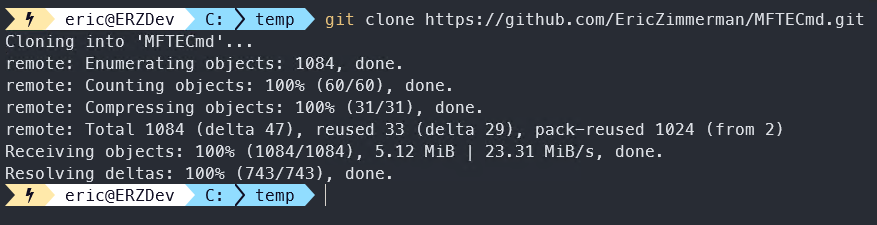
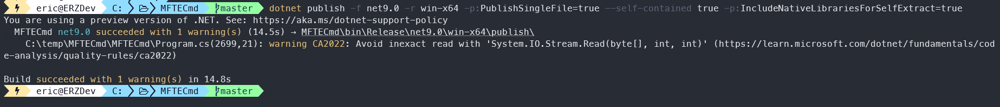
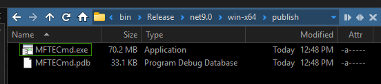

<H1>How to build self-contained executables</H1>

1. Pick a repository. In this example, we will use MFTECmd.
2. Open a shell (like powershell for example) and change directories to where you want the repository cloned. Here, I am using `C:\Temp`
3. Run `git clone https://github.com/EricZimmerman/MFTECmd.git`

    

4. Change to the repository directory `cd c:\Temp\MFTECmd\`
5. Build with `dotnet publish -f net9.0 -r win-x64 -p:PublishSingleFile=true --self-contained true -p:IncludeNativeLibrariesForSelfExtract=true`

    

6. go to `C:\Temp\MFTECmd\MFTECmd\bin\Release\net9.0\win-x64\publish` and you will see your executable

    

7. ???
8. Profit

As an example, the 'normal' net9 version of MFTECmd is 2.56MB across 3 files, whereas the self-contained version is 74.4MB!

This is certainly a tradeoff, but it works.

Simply repeat this for any other executable you want, then TEST it out.
